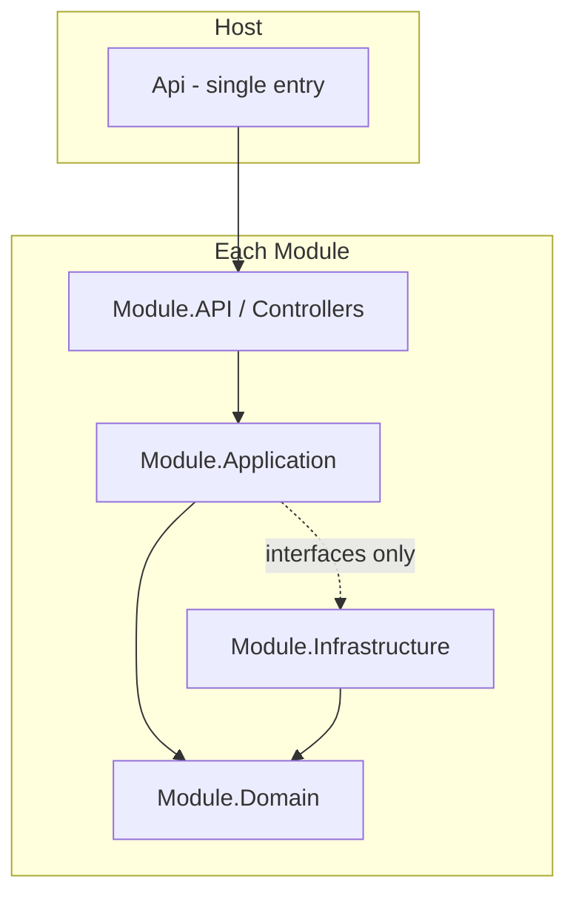
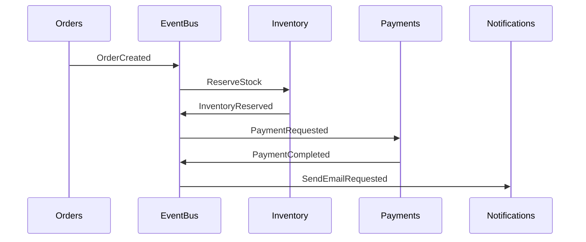

# 02 — Architecture Overview

## Style (MUST)

- **Modular Monolith** + **Clean Architecture**
- **CQRS** (MediatR) per feature
- **Event-driven** inter-module communication
- **Domain-first** development

## Architecture Principles (MUST)

1. SOLID
2. Clean Architecture layer rules
3. Modular Monolith — bounded contexts isolated
4. CQRS for use cases
5. Event-Driven between modules
6. Composition over inheritance
7. Dependency Injection everywhere
8. **Async all the way** + `CancellationToken`
9. No cross-module `DbContext`
10. Avoid tight coupling

## Layer Dependency



**MUST:**

```
API → Application → Domain
Infrastructure → Domain (implements Domain/Application interfaces)
```

| Layer | Responsibility | MUST NOT |
|-------|----------------|----------|
| Domain | Entities, aggregates, VOs, domain events, repo interfaces | EF Core, SQL, Redis, HTTP |
| Application | Use cases, Commands/Queries, DTOs, validators | Direct DB access |
| Infrastructure | EF Core, repos, Redis, RabbitMQ | Business rules |
| API | Thin controllers, DI | Business logic |

## Inter-Module Communication



**MUST:** Domain Events (in-process) + Integration Events (RabbitMQ) via `BuildingBlocks/EventBus`.

**MUST NOT:** Reference another module's Infrastructure or DbContext.

## Related docs

- Backend tree: [03-backend-structure.md](03-backend-structure.md)
- Events: [10-event-driven.md](10-event-driven.md)
