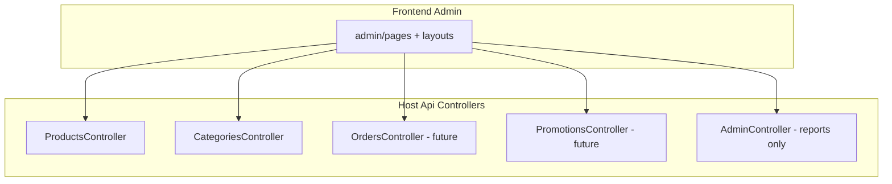
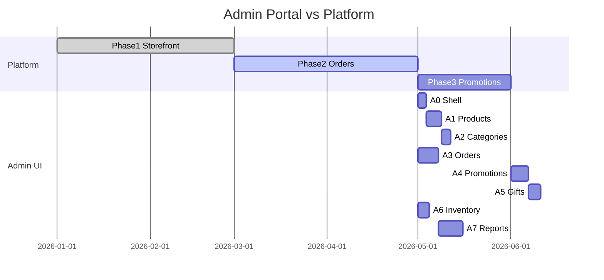

# 16 — Admin Portal: Phases & Screen Plan

> **Mục tiêu:** Cho phép Claude/Cursor lên kế hoạch và implement **từng màn hình admin** (catalog, khuyến mãi, quà tặng, đơn hàng, báo cáo) mà không nhầm module, không build trước dependency.

**Đọc kèm:** `04-frontend-structure.md`, `08-api.md`, `09-security.md`, `12-roadmap.md`, `modules/admin.md`, `modules/promotions.md`.

---

## 1. Nguyên tắc kiến trúc Admin

| Quy tắc | Chi tiết |
|---------|----------|
| **Admin UI** | `frontend/src/modules/admin/` — route prefix `/admin/*`, layout riêng |
| **Business CRUD** | Thuộc **module nghiệp vụ** (Products, Orders, Promotions…) — **không** nhét logic vào Admin.Domain |
| **Admin module (BE)** | Chỉ cho: dashboard tổng hợp, báo cáo read-model, audit log (sau), re-export API nếu cần BFF |
| **Authorization** | JWT role `Admin` hoặc `Staff` + policy `AdminOnly` / `StaffOrAdmin` |
| **Thứ tự** | Backend use case → API → test → **một màn admin** → hook React Query |
| **Một task = một màn** | Không gộp “toàn bộ admin” trong một PR |



---

## 2. Map phụ thuộc: Admin screen ↔ Backend module

| Nhóm màn hình | Backend module | Trạng thái hiện tại (2026-05) |
|---------------|----------------|-------------------------------|
| Đăng nhập admin | Auth | ✅ Login + role Admin seed |
| Sản phẩm | Products | ✅ Search, Get, Create, Update — thiếu Delete, upload ảnh |
| Danh mục | Products (Categories) | ✅ Get tree, Create — thiếu Update, Delete |
| Đơn hàng | Orders | ⏳ Skeleton |
| Tồn kho | Inventory | ⏳ Skeleton |
| Khuyến mãi / Coupon | Promotions | ⏳ Skeleton |
| Quà tặng | Promotions (sub-domain) | ⏳ Chưa có |
| Khách hàng | Users + Auth | ✅ Profile read — thiếu admin list |
| Báo cáo / Dashboard | Admin (+ read từ Orders/Payments) | ⏳ Skeleton |

**Không bắt đầu** màn Orders/Promotions/Reports cho đến khi cột “Backend” có API tương ứng (hoặc task ghi rõ “stub UI”).

---

## 3. Admin Portal Phases (A0 → A7)

Các phase **A*** chạy **song song** roadmap chính (Phase 1–4) nhưng **bị chặn** bởi API.

### A0 — Prerequisites (1–2 ngày)

**Mục tiêu:** Admin có thể đăng nhập và gọi API bảo vệ.

| # | Deliverable | Module |
|---|-------------|--------|
| A0.1 | `AdminLayout` + sidebar + breadcrumb | FE admin |
| A0.2 | `AdminRoute` guard: role `Admin` \| `Staff` | FE + Auth |
| A0.3 | Route tree `/admin`, redirect `/admin` → dashboard placeholder | FE routes |
| A0.4 | `adminApiClient` hoặc tái dùng `apiClient` + token | FE services |
| A0.5 | (Optional) `GET /api/v1/admin/health` hoặc ping | Admin BE |

**Prompt mẫu Claude:**
```
Implement Admin shell A0: layout, sidebar, ProtectedRoute for Admin role.
Read: 16-admin-portal-phases.md, 04-frontend-structure.md, 09-security.md, modules/admin.md
```

---

### A1 — Catalog: Products (3–5 ngày)

**Phụ thuộc:** Products API (đã có Create/Update/Search).

| Màn hình | Route | API / Use case |
|----------|-------|----------------|
| Danh sách SP | `/admin/products` | `GET /products` (search, filter, pagination) |
| Tạo SP | `/admin/products/new` | `POST /products` |
| Sửa SP | `/admin/products/:id/edit` | `GET /products/{id}`, `PUT /products/{id}` |
| (Sau) Xóa / ẩn | action trên list | `DeleteProduct` hoặc `ArchiveProduct` — **cần thêm BE** |

**Backend bổ sung (nếu chưa có):**
- `DeleteProduct` / `ArchiveProduct` command
- `PublishProduct` / `UnpublishProduct` (dùng `ProductStatus` domain)

**FE structure:**
```
modules/admin/
├── layouts/AdminLayout.tsx
├── pages/catalog/
│   ├── ProductListPage.tsx
│   ├── ProductFormPage.tsx      # create + edit
├── components/catalog/
│   ├── ProductTable.tsx
│   └── ProductFormFields.tsx
├── hooks/useAdminProducts.ts
└── services/adminProductsApi.ts
```

**Prompt mẫu:**
```
Implement admin ProductListPage + ProductFormPage (create/edit).
Read: 16-admin-portal-phases.md A1, modules/products.md, 08-api.md
Backend first if Delete/Archive missing.
```

---

### A2 — Catalog: Categories (2–3 ngày)

**Phụ thuộc:** Categories API.

| Màn hình | Route | API |
|----------|-------|-----|
| Cây danh mục | `/admin/categories` | `GET /categories?tree=true` |
| Tạo / sửa | modal hoặc `/admin/categories/new` | `POST /categories`, **thêm** `UpdateCategory`, `DeleteCategory` |

**Backend bổ sung:** `UpdateCategory`, `DeleteCategory` (validate: không xóa nếu còn product con).

---

### A3 — Orders & Fulfillment (5–7 ngày)

**Phụ thuộc:** Phase 2 — **Orders module** hoàn chỉnh.

| Màn hình | Route | Use cases |
|----------|-------|-----------|
| Danh sách đơn | `/admin/orders` | `SearchOrders` (filter: status, date, customer) |
| Chi tiết đơn | `/admin/orders/:id` | `GetOrderById`, timeline trạng thái |
| Đổi trạng thái | trên detail | `ConfirmOrder`, `ShipOrder`, `CancelOrder`, `RefundOrder` (policy Staff/Admin) |
| In / export | optional | PDF hoặc CSV — phase sau |

**Events:** đọc `10-event-driven.md` — admin không gọi trực tiếp Inventory DbContext.

---

### A4 — Promotions & Coupons (4–6 ngày)

**Phụ thuộc:** **Promotions module** (Phase 3).

| Màn hình | Route | Entity / API |
|----------|-------|----------------|
| Danh sách KM | `/admin/promotions` | `Promotion`, `CouponCode` |
| Tạo / sửa campaign | `/admin/promotions/new`, `/:id/edit` | `CreatePromotion`, `UpdatePromotion` |
| Coupon codes | tab trong form | `GenerateCoupons`, `DeactivateCoupon` |

**Loại khuyến mãi (MVP):**
- Percent / fixed amount off
- Min order value
- Date range + active flag
- Applicable categories / products (ID list, không FK cross DbContext)

---

### A5 — Gifts (Quà tặng) (3–4 ngày)

**Phụ thuộc:** A4 + Products.

**Quy ước module:** Quà tặng nằm trong **Promotions** (`GiftRule`, `FreeGiftLine`) — không tách module riêng trừ khi phình to.

| Màn hình | Route | Mô tả |
|----------|-------|--------|
| Danh sách quà | `/admin/gifts` | Quà kèm đơn (buy X get Y), quà đổi điểm (sau) |
| Tạo / sửa rule | `/admin/gifts/new`, `/:id/edit` | ProductId quà, điều kiện min qty / min amount |

**Backend:** `CreateGiftRule`, `ListGiftRules`, `UpdateGiftRule`, `DeactivateGiftRule`.

---

### A6 — Inventory (Stock) (3–4 ngày)

**Phụ thuộc:** **Inventory module** (Phase 2).

| Màn hình | Route | Use case |
|----------|-------|----------|
| Tồn kho theo SKU | `/admin/inventory` | `SearchStock`, filter low stock |
| Điều chỉnh tồn | modal | `AdjustStock` (admin only, audit) |
| Lịch sử biến động | tab | `GetStockMovements` |

---

### A7 — Reports & Dashboard (5–8 ngày)

**Phụ thuộc:** Orders + Payments có dữ liệu thật.

| Màn hình | Route | Nguồn dữ liệu |
|----------|-------|----------------|
| Dashboard | `/admin` hoặc `/admin/dashboard` | Admin module read queries |
| Doanh thu | `/admin/reports/revenue` | `GetRevenueReport` (by day/week/month) |
| Đơn hàng | `/admin/reports/orders` | count by status, conversion |
| Sản phẩm bán chạy | `/admin/reports/products` | top N từ order lines |
| Xuất CSV | nút trên từng report | streaming export — optional |

**Admin BE:** aggregate queries / SQL views — **read-only**, không business write.

**MVP metrics:**
- Tổng doanh thu (khoảng thời gian)
- Số đơn: pending / paid / shipped / cancelled
- Top 10 SKU
- (Sau) Lợi nhuận gộp nếu có cost price

---

## 4. Customers & Staff (A8 — optional, sau A3)

| Màn hình | Route | Module |
|----------|-------|--------|
| Danh sách khách | `/admin/customers` | Users — `SearchCustomers` |
| Chi tiết KH | `/admin/customers/:id` | profile + orders (compose từ Orders API) |
| Quản lý staff | `/admin/staff` | Auth — `InviteStaff`, roles (Admin only) |

---

## 5. Menu sidebar (chuẩn hoá)

```
Dashboard
── Catalog
    Products
    Categories
── Sales
    Orders
── Marketing
    Promotions
    Gifts
── Inventory
    Stock levels
── Customers        (phase A8)
── Reports
    Revenue
    Orders
    Products
── Settings          (sau)
```

Icon + label tiếng Anh trong code; UI label có thể VI.

---

## 6. Checklist mỗi màn hình (Claude MUST)

- [ ] Xác định **owning backend module** (không tạo entity trong Admin trừ report)
- [ ] Command/Query + Handler + Validator đã có hoặc tạo trước
- [ ] Controller endpoint + `[Authorize(Policy = ...)]`
- [ ] FE: `services/*Api.ts` → `hooks/use*.ts` → `pages/*Page.tsx`
- [ ] Form: validation client mirror FluentValidation
- [ ] Loading / error / empty state
- [ ] Table pagination khớp `pagination` envelope
- [ ] Không hardcode role — dùng constant từ `shared/constants/roles.ts`

---

## 7. Thứ tự implement đề xuất (tổng hợp)



**Có thể làm ngay:** A0 → A1 → A2 (backend Products đã sẵn phần lớn).

**Phải chờ:** A3 (Orders), A4–A5 (Promotions), A6 (Inventory), A7 (có order data).

---

## 8. API route convention (Admin)

| Pattern | Ví dụ |
|---------|--------|
| Resource module | `/api/v1/products`, `/api/v1/categories` |
| Admin-only write | Same routes + `AdminOnly` policy (hiện tại) |
| Admin reports | `/api/v1/admin/reports/revenue?from=&to=` |
| Admin orders (nếu tách) | `/api/v1/admin/orders` **hoặc** `/api/v1/orders` + policy — **chọn một**, document trong `modules/orders.md` |

**Khuyến nghị:** Orders dùng `/api/v1/orders` với policy phân quyền; chỉ report dùng `/api/v1/admin/*`.

---

## 9. UI / UX gợi ý (đủ để Claude đồng nhất)

- Layout: sidebar cố định + header (user menu, logout)
- Table: sort, filter, page size 20/50
- Form: React Hook Form + Zod (nếu project đã dùng) hoặc controlled inputs
- Màu admin tách biệt storefront (ví dụ slate/indigo) — tái dùng `card`, `btn` từ shared
- Toast thông báo success/error từ `message` envelope

---

## 10. Liên kết roadmap chính

| Roadmap chính (`12-roadmap.md`) | Admin phase |
|--------------------------------|-------------|
| Phase 1 complete | A0, A1, A2 |
| Phase 2 Orders, Inventory, Payments | A3, A6 |
| Phase 3 Promotions | A4, A5 |
| Phase 4 Admin, Analytics | A7 |

---

## 11. Ví dụ prompt theo từng phase

**A1 — một màn:**
```
Task: Admin ProductListPage only.
Read: .ai/context/16-admin-portal-phases.md (section A1), modules/products.md, 04-frontend-structure.md, 08-api.md
Do not implement promotions or orders.
```

**A4 — backend trước:**
```
Task: Promotions module CreatePromotion + ListPromotions + Admin API.
Then: Admin PromotionListPage + PromotionFormPage.
Read: 16-admin-portal-phases.md A4, modules/promotions.md, 05-module-layout.md, 06-backend-rules.md
```

**A7 — reports:**
```
Task: GetRevenueReport query in Admin.Application + AdminController endpoint.
Then: Admin RevenueReportPage with date range filter.
Read: 16-admin-portal-phases.md A7, modules/admin.md
```

---

*Last updated: 2026-05-18*
